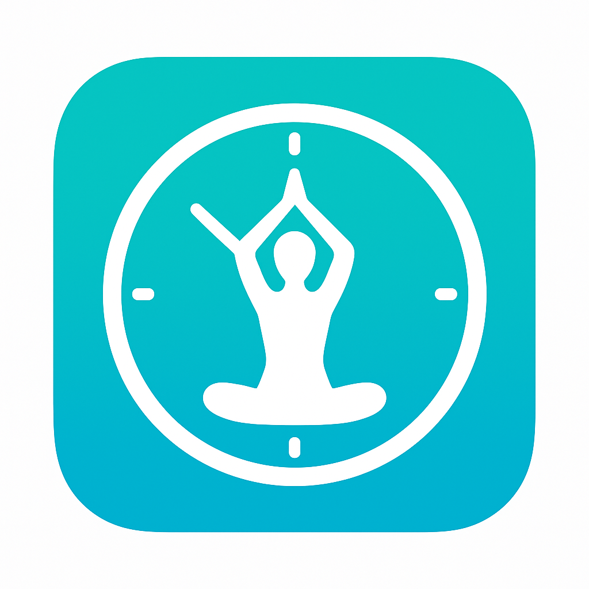
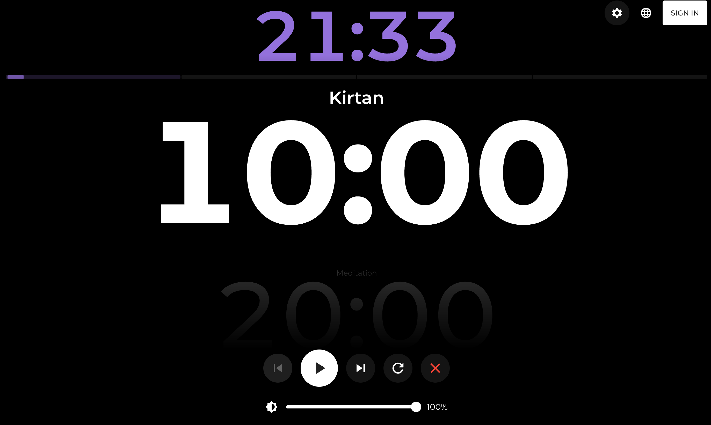
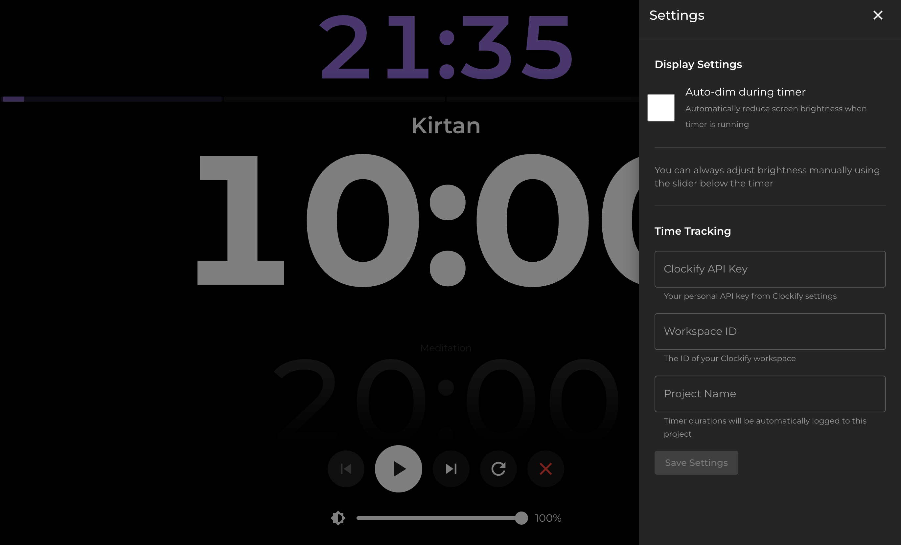
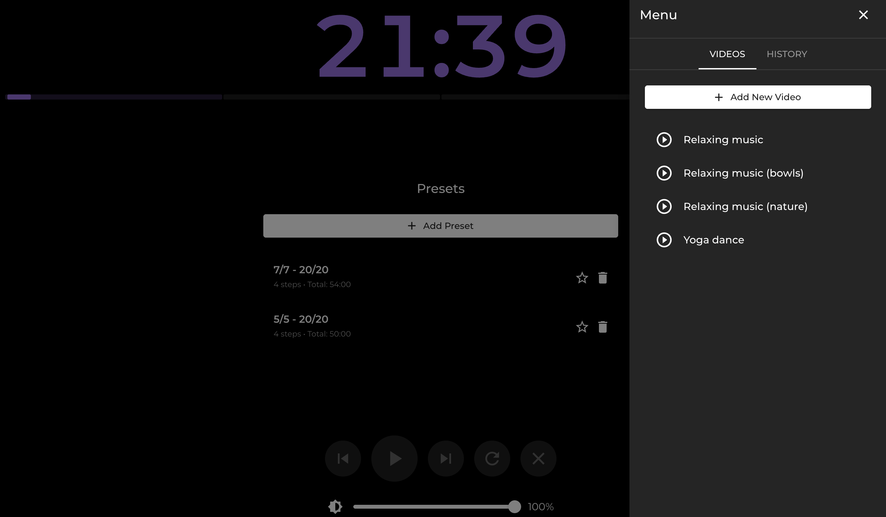
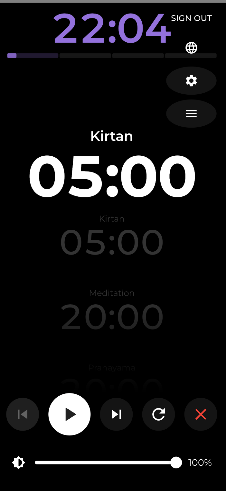

  
  
  # My Yoga Practice
  
  **A minimalist yoga and meditation timer with Clockify integration**
  
  
  
  
  

---

[Website](https://my-yoga-practice.web.app/)

I built this project to streamline yoga practice for my wife and me. We wanted to focus on the flow rather than constantly interacting with a phone. Previously, we had to manually reset timers between every stage of our practice and use a separate app like Clockify to log our time. This application solves those distractions by automating the sequence of timers and tracking the duration in the background, allowing us to simply follow the sound of the gong and stay immersed in the practice.

## ✨ Features

- **Multi-step Timer Queue** - Create sequences of timers (kirtan, types of meditation or just time breakpoints)
- **Gong Sounds** - Traditional bell sounds between timer transitions
- **Manual Time Adjustment** - Click left/right on timer to adjust duration on the fly
- **Timer Navigation** - Skip forward/backward through timer queue
- **Loop Mode** - Automatically restart timer sequence when complete
- **Yoga Period Indicator** - Color-coded display showing current yoga period (4 daily periods, useful for some practice)
  

- **Background Dimming** - Automatic screen dimming during meditation sessions (for dark mornings and evenings)
- **Clockify Integration** - Automatic time tracking to Clockify workspace
- **Watch Time Tracking** - Automatically track video viewing time to Clockify
  

- **Custom Presets** - Create and save your own timer sequences
- **Favorite Preset** - Mark one preset to auto-load on startup
- **YouTube Player** - Save your favorite yoga videos for quick access (some music for the practice or some yoga dance videos)
  

- **Responsive Design** - Works on desktop, tablet, and mobile devices
  
